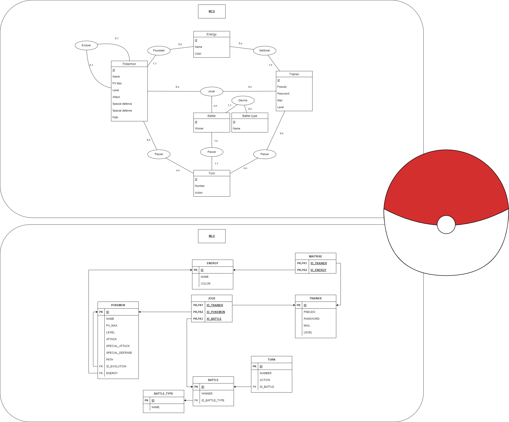

# Auteur
- DEVA Nilavan

# Jalon 3

!! Description !!

Fonctionnalités implémentées :
- Migrations
- Seeders
- Models
- Factories
- Relations entre les tables

Méthode pour initialiser la base de données :
Par les migrations / seeders.
'''
php artisan migrate:fresh --seed
'''

Route :
Aucune

Identifiants sur le site :
Aucun

Vidéo de démonstration : Aucune