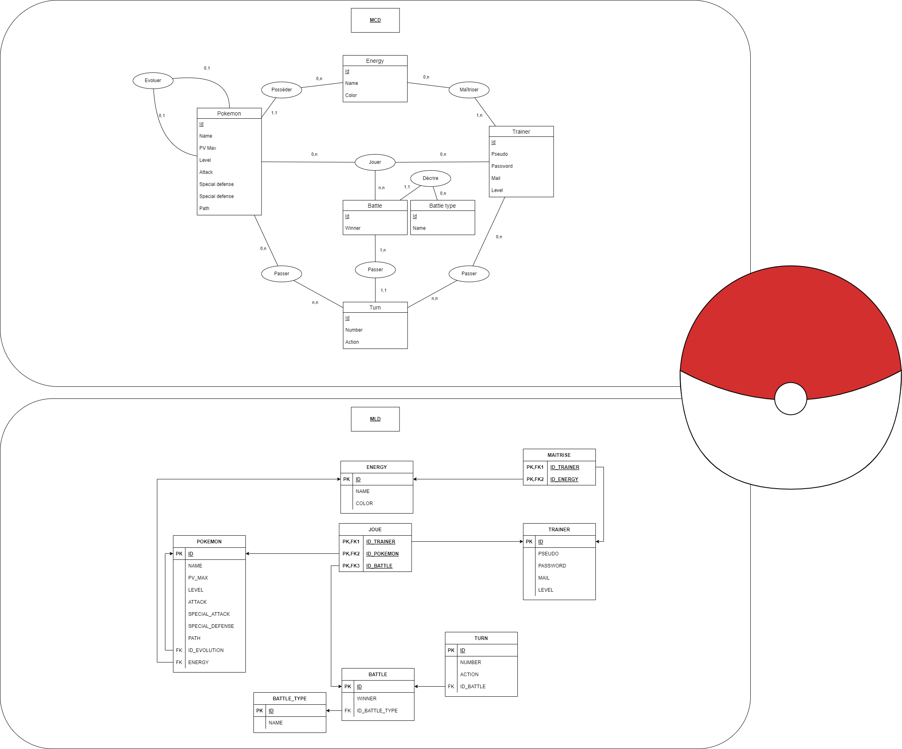

# Auteur
- DEVA Nilavan

# Jalon 3

Après avoir fait le MCD et MLD de la base de donnée (visible ci-dessous) et avoir appris le fonctionnement d'une DataTables, on a créer les migrations, seeders, models, factories et relations entre les chacuns.

Enfin on utilise une DataTables pour afficher la liste de Pokémons faite durant le jalon 2.

Note : Le système d'historique des parties n'est pas encore complètement fini, il sera rajouté/modifé plus tard dans le MCD et MLD.



Fonctionnalités implémentées :
- MCD MLD au format pdf ou jpg ou png
- Les migrations et seeders pour créer et remplir votre base de données
- Une DataTables qui affiche le pokédex

Méthode pour initialiser la base de données :

Par les migrations / seeders :
```
php artisan migrate:fresh --seed
```

Route :
http://127.0.0.1:8000/pokedex

Identifiants sur le site :
Aucun

Vidéo de démonstration : Aucune